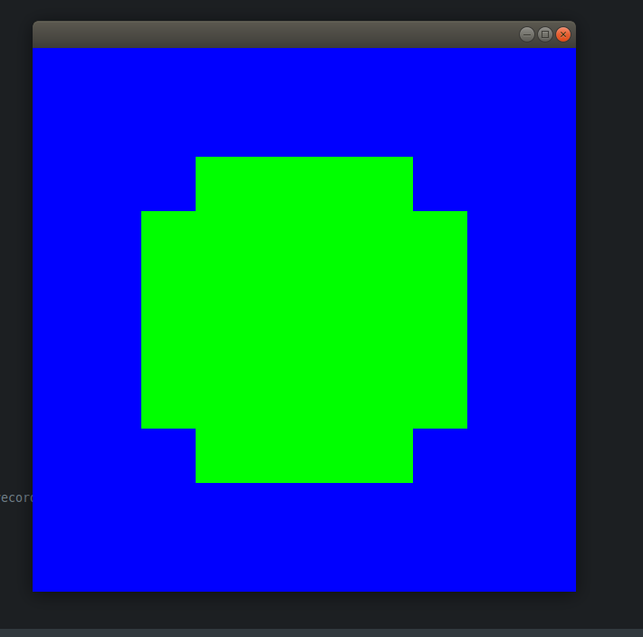

# RayTracer

This was a project I worked on for months during the later part of Year 11 at high school. This was easily my biggest project at the time and was a huge source of procrastination from schoolwork lol. Now this project is lost to time, but maybe some day I'll be inspired to rewrite it, probably in Rust, who knows. I've added some iconic renders from the development period below because I think they are worth showing off.

It was a huge learning experience and is one of my favourite projects still, I am incredibly glad I did it. From a high school student that built this up from scratch in Java, I am still incredibly proud of the quality of the images it was able to produce.

## First render of a sphere (at 10x10 resolution)

## First render of a plane as well, slicing through the sphere (Orthogonal Camera still, no perspective)

## Implementation of shadows

## Implementation of reflections

This was also when I first began rendering frame sequences to make animations.

## First animation

## Then I added specular lighting

## And rendered another animation

## Then added smooth lighting

## And rendered another animation

## And realised how cool such simple scenes could be when rendered at very high resolutions

## Then made triangles, 

## So that I could construct objects from meshes

## And even import them from OBJ files

## Which did an amazing job of rendering cute pixel art :3

## Then struggle to add textures

## Then succeed to add textures

## Then I worked to smooth the normals of meshes

## And add transformations to meshes

## And then worked on adding skyboxes (Different colours represented which image to sample for the cubemap)

## And finally the last thing I did was to finish the skybox before abandoning this project

